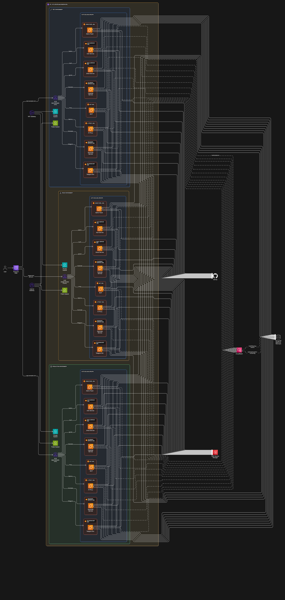

# 🧱 Production-Grade Microservices Infrastructure on AWS EC2 (Horizontally Scalable)

This repository presents a fully modular, horizontally scalable, microservice-based infrastructure built on **AWS EC2**, with **native autoscaling**, **secure secrets management**, and **environmental separation** — implemented **without using any DevOps tooling like Jenkins, GitHub Actions, or Terraform**.

It is designed as a **practical cloud-native deployment model** where infrastructure decisions follow operational simplicity, cost efficiency, and system modularity.

---

## 🎯 Objective

The goal of this setup is to demonstrate **how to build a cloud-native, production-grade system architecture** using nothing but **AWS core services** — no IaC, no CI/CD pipelines.

This project aims to show:

- How multiple microservices can be isolated, scaled, and deployed independently  
- How credentials and environments can be managed securely  
- How to maintain a smooth deployment flow using branch strategies  
- How to reduce dependency on automation by leveraging AWS-native behaviors

---

## ⚙️ System Overview

This project powers a multi-microservice SaaS-style application. Each microservice is deployed in its own EC2 instance group with independent scaling policies, while shared services like the database and ALB provide centralized functionality.

### Components

| Category              | Tools / Services |
|-----------------------|------------------|
| Compute               | EC2 (per service) |
| Scaling               | Auto Scaling Groups (per microservice) |
| Load Balancing        | AWS ALB |
| Secrets Management    | AWS Secrets Manager |
| Environment Control   | Branch-based deployment: `test`, `stage`, `prod` |
| Database              | MongoDB (self-hosted on EC2, shared) |
| Frontend              | React-based admin panel |
| Process Management    | PM2 for Node.js services |
| Source Control        | GitHub (multi-branch strategy)

---

## 🧩 Microservice Structure

| Service              | Purpose |
|----------------------|---------|
| `auth-service`       | Authentication & session management |
| `gmail-service`      | Gmail API and webhook integration |
| `calendar-service`   | Google Calendar sync |
| `reminder-service`   | Scheduled jobs & triggers |
| `telegram-bot`       | Telegram entry point (Webhook) |
| `mcp-service`        | Message router and tool selector |
| `ai-proxy-service`   | AI model connector (OpenAI, Ollama, etc.) |
| `admin-panel`        | Admin UI (React frontend) |
| `mongodb`            | Central database (shared)

Each of the above services is deployed on a **dedicated EC2 instance (or ASG)**, and scaled **independently** based on usage and CPU thresholds.

---

## 🔄 Deployment Process

Deployment follows a **manual, controlled, and predictable** flow using Git branches and EC2 instance refreshes:

1. Code is pushed to one of the 3 branches:
   - `test` → test environment
   - `stage` → staging environment
   - `main` → production environment

2. The AWS engineer:
   - Terminates existing EC2 instances
   - New EC2s are spawned automatically via ASG
   - Instance bootstraps via **User Data**:
     - Pulls specific branch from GitHub
     - Loads environment variables from Secrets Manager
     - Installs dependencies & starts process with PM2

📌 Deployment is secure, consistent, and isolated — with **zero hardcoded secrets**.

📄 See [`deployment-strategy.md`](./deployment-strategy.md) for the full deployment flow.

---

## 🛠️ Architecture Overview

A high-level diagram showing the modular deployment and communication paths is included below:

> 

📄 Full breakdown available in [`architecture.md`](./architecture.md)

---

## 📈 Autoscaling Model

- Each microservice has its own **Auto Scaling Group**
- Scaling is based on **CPU thresholds** or **network traffic**
- MongoDB can also be scaled via replica sets (planned extension)
- All instances are monitored and automatically replaced as needed

📄 See [`autoscaling.md`](./autoscaling.md) for ASG config and lifecycle flow

---

## 🔒 Security Considerations

This system includes the following controls:

- All EC2 instances are in **private subnets**
- Public traffic is routed via **AWS ALB**
- No inbound access to EC2s except through ALB
- All secrets (API keys, DB URIs, GitHub tokens) stored in **Secrets Manager**
- IAM roles grant scoped access to each EC2 group
- MongoDB access is IP/firewall restricted within VPC

📄 See [`security.md`](./security.md) for complete design

---

## 🌐 Branch-to-Environment Mapping

| Git Branch | AWS Environment | Purpose |
|------------|------------------|---------|
| `test`     | Test environment | Dev + smoke testing |
| `stage`    | Staging          | Pre-production verification |
| `main`     | Production       | Live deployment environment |

Each environment has its own EC2 setup, Secrets config, and ALB rules.

---

## 🧰 System Features Summary

- ✅ Horizontal auto scaling for each microservice
- ✅ Deployment versioning using Git branches
- ✅ Secure credential handling with AWS Secrets Manager
- ✅ Shared MongoDB database with restricted access
- ✅ Single responsibility per EC2 instance
- ✅ Modular and loosely coupled services
- ✅ Load-balanced architecture with private subnet isolation
- ✅ Clean fallback and rollback by EC2 group rotation

---

## 📁 Documentation Index

| File | Description |
|------|-------------|
| `architecture.md`        | System diagram and cloud architecture reasoning |
| `deployment-strategy.md` | Environment control via Git branches |
| `autoscaling.md`         | Scaling policies, triggers, and fallback behavior |
| `security.md`            | IAM roles, Secrets Manager usage, subnet rules |
| `microservices.md`       | Description of each service |
| `user-data-script.md`    | Instance provisioning and boot logic |
| `sops.md`                | Step-by-step runbook for operations |
| `diagram-architecture.drawio.json` | Editable diagram source |
| `env-example.md`         | Environment key reference |

---

## 📌 Notes

This project is structured to simulate a **fully operational deployment pipeline** using only core AWS services. It offers a foundation that can be extended into:

- CI/CD tools (e.g., GitHub Actions, Jenkins)
- Infrastructure-as-Code (e.g., Terraform, Pulumi)
- Monitoring/Alerting (e.g., CloudWatch, Prometheus)
- Cost optimizations and predictive scaling

The current implementation is **manual by design**, in order to demonstrate operational decision-making without relying on external tools.

---

## 📎 License

MIT (You can change this as needed)
